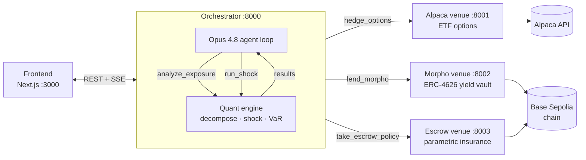
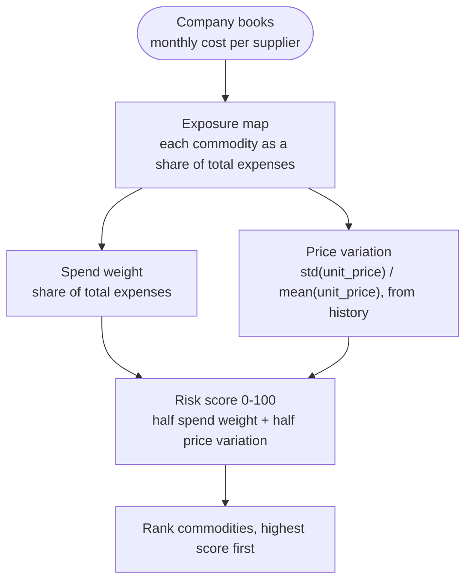
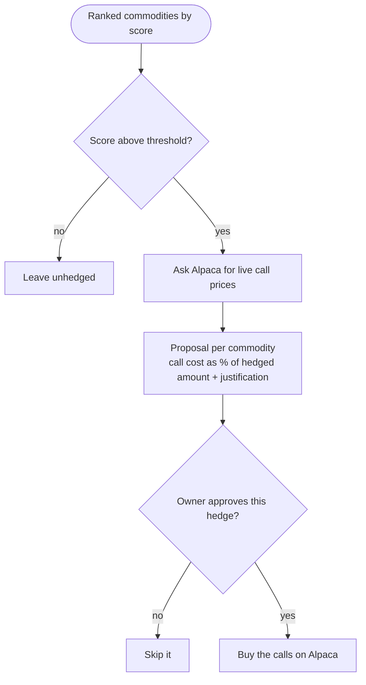

# 🌶️ Spice — the autonomous commodity-hedging desk for ordinary businesses

*The Exotic Asset Company. Built for a YC hackathon (décacorn track).*

Every ordinary business is an unhedged commodity trader without knowing it. A bakery's
costs rise and fall with wheat, gas, power and butter; a trucking firm's with oil; a
foundry's with electricity and copper. The owner can't see that exposure, price it, or
hedge it, because hedging used to need a trading desk and real size. Spice reads a
company's cost structure, finds the commodities hidden underneath, works out what a price
spike does to its margin, and hedges it across options, on-chain lending and parametric
insurance. A €1.4M bakery ends up with the risk desk that used to belong to a Fortune 500
treasury.

---

## Architecture

The orchestrator is the center. It holds the quant engine (in-process) and the Opus
agent loop, talks to the frontend over REST + SSE, and calls each execution venue over
HTTP. A venue that is down degrades to a believable artifact so a live demo never
hard-fails.



## How the risk desk decides

### Score every commodity (quant engine)

The quant engine reduces the books to one number per commodity. It weighs two things:
how big a share of total spend the commodity is, and how unstable its unit price has
been historically (the coefficient of variation, standard deviation over mean). It blends
them into a 0-100 risk score and ranks the commodities by it.



### Turn scores into hedges, with the owner's sign-off

The agent takes the ranked list, keeps the commodities whose score clears the threshold
(in the demo, the two biggest), and asks the Alpaca service for live call-option prices.
It returns one proposal per commodity: the cost of the call as a percent of the amount
being hedged, plus a plain justification drawn from the historical price risk. Nothing
executes until the owner approves each one.



Example proposal the agent can make: the bakery already buys all of its wheat at spot and
plans to buy about 50% more next year. Locking today's price with a call now caps the
damage if wheat spikes before those purchases, for a premium worth a few percent of the
volume covered.

## Repo

| Path | What |
|---|---|
| [`docs/BRIEF.md`](docs/BRIEF.md) | Idea, insight, beachhead, moat |
| [`docs/COMPETITION.md`](docs/COMPETITION.md) | Competitive whitespace map |
| [`docs/DEMO.md`](docs/DEMO.md) | Demo script and locked decisions |
| [`data-generation/`](data-generation/) | Synthetic SMB cash-plan generator (`cashplan/` + CLI) |
| [`backend/quant-engine/`](backend/quant-engine/) | Quant engine, Opus agent, orchestrator server ([API contract](backend/quant-engine/API_CONTRACT.md)) |
| [`backend/alpaca-backend/`](backend/alpaca-backend/) | Commodity-ETF options service + exposure inference |
| [`backend/morpho-backend/`](backend/morpho-backend/) | Idle-cash yield via Morpho ERC-4626 vault |
| [`backend/escrow-backend/`](backend/escrow-backend/) | Parametric insurance escrow (on-chain) |
| [`spice-frontend/`](spice-frontend/) | Next.js dashboard, analysis and execution screens |
| [`.claude/skills/`](.claude/skills/) | Claude Code skills for driving each tool |

## Run the quant engine (no setup)

No keys, no network. Prints the full analysis for the synthetic bakery *Maison Levain*.

```bash
cd backend/quant-engine
python run_analysis.py
```

It re-expresses Maison Levain as a commodity book and prints the decomposition, a price
shock that takes net margin from 11% to 3.3%, the hedge that restores it to 11%, and the
annual margin VaR falling from 13.1% to 2.0% of revenue.

## Run the full stack

Each backend uses the same setup, once per service:

```bash
cd backend/<service>            # quant-engine | alpaca-backend | morpho-backend | escrow-backend
python -m venv .venv && source .venv/bin/activate
pip install -r requirements.txt
cp .env.example .env            # fill the keys that service needs
```

Start the venues, then the orchestrator, then the frontend:

| Order | Service | Command (from its directory) | Port |
|---|---|---|---|
| 1 | Alpaca | `uvicorn app_alpaca:app --port 8001` | 8001 |
| 2 | Morpho | `uvicorn app:app --port 8002` | 8002 |
| 3 | Escrow | `uvicorn app:app --port 8003` | 8003 |
| 4 | Orchestrator | `uvicorn spice.server:app --port 8000` | 8000 |
| 5 | Frontend | `npm install && npm run dev` | 3000 |

Keys per service: `ANTHROPIC_API_KEY` for the live agent (quant-engine); `ALPACA_KEY` /
`ALPACA_SECRET` for Alpaca; `WALLET_PRIVATE_KEY` plus chain config for the Morpho and
escrow on-chain calls. With no keys, start a deterministic run that needs no LLM and no
venues:

```bash
curl -s -X POST "http://localhost:8000/api/run?mock=true"
# then stream events: GET http://localhost:8000/api/run/{run_id}/events
```

Keep every `.env` out of git, and rotate any key that has touched a chat or transcript.

## Driving the tools from Claude Code

The skills in `.claude/skills/` document each service so Claude can run them. Start with
`spice` for the stack overview, then `spice-quant`, `spice-alpaca`, `spice-morpho`, or
`spice-escrow` for a specific venue.

## Hero demo

A bakery hedges like a trading desk. Spice ingests the books, surfaces the hidden wheat
and gas exposure, forecasts the margin hit, hedges across the three venues, and then the
operator fires the heatwave shock live while the parametric payout settles on-chain.
