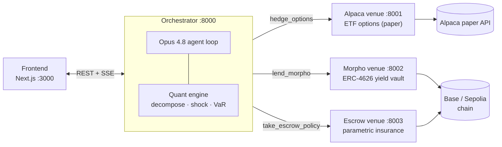

# 🌶️ Spice — autonomous commodity-hedging desk for ordinary businesses

*The Exotic Asset Company. Built for a YC hackathon (décacorn track).*

## TL;DR

A bakery's costs are mostly wheat, gas, electricity and fats. When those prices
move, its margin moves with them, and the owner has no way to see or hedge that
exposure. Spice reads a company's cost structure, re-expresses it as the basket of
commodities hidden underneath, computes how much a price shock would cost in margin,
and then hedges it across three venues: call options on commodity ETFs, an on-chain
yield vault for idle cash, and a parametric insurance policy for the weather risk
options can't price. An Opus 4.8 agent runs the loop; a human approves before any
money moves. A €1.4M bakery ends up with the kind of risk desk that used to need a
Goldman relationship.

The numbers, on the synthetic hero company *Maison Levain*: a commodity shock takes
net margin from 11% to 3.3%; the recommended hedge restores it to 11% and cuts annual
margin VaR from 13.1% to 2.0% of revenue.

## Architecture

The orchestrator is the center. It holds the quant engine (in-process) and the Opus
agent loop, talks to the frontend over REST + SSE, and calls each execution venue over
HTTP. A venue that is down degrades to a believable artifact so a live demo never
hard-fails.



Frontend contract and event shapes live in
[`backend/quant-engine/API_CONTRACT.md`](backend/quant-engine/API_CONTRACT.md).

## Repo layout

| Path | What |
|---|---|
| [`docs/BRIEF.md`](docs/BRIEF.md) | Idea, insight, beachhead, moat |
| [`docs/COMPETITION.md`](docs/COMPETITION.md) | Competitive whitespace map |
| [`docs/DEMO.md`](docs/DEMO.md) | Demo script, locked decisions |
| [`data-generation/`](data-generation/) | Synthetic SMB cash-plan generator (`cashplan/` + CLI) |
| [`backend/quant-engine/`](backend/quant-engine/) | Quant engine, Opus agent, orchestrator server |
| [`backend/alpaca-backend/`](backend/alpaca-backend/) | Commodity-ETF options service (paper) + exposure inference |
| [`backend/morpho-backend/`](backend/morpho-backend/) | Idle-cash yield via Morpho ERC-4626 vault |
| [`backend/escrow-backend/`](backend/escrow-backend/) | Parametric insurance escrow (on-chain) |
| [`spice-frontend/`](spice-frontend/) | Next.js dashboard, analysis and execution screens |
| [`.claude/skills/`](.claude/skills/) | Claude Code skills for driving each tool |

## Run the quant engine alone (zero setup)

No keys, no network. Prints the full analysis for Maison Levain.

```bash
cd backend/quant-engine
python run_analysis.py
```

## Deploy the whole stack

Prerequisites: Python 3.11+, Node 18+, and (optional) an `ANTHROPIC_API_KEY` for the
live agent. Without keys you can still run the deterministic demo (`mock=true`, below).

Each backend follows the same setup. Run it once per service:

```bash
cd backend/<service>            # quant-engine | alpaca-backend | morpho-backend | escrow-backend
python -m venv .venv && source .venv/bin/activate
pip install -r requirements.txt
cp .env.example .env            # fill the keys that service needs (table below)
```

Start the venues first, then the orchestrator, then the frontend:

| Order | Service | Command (from its directory) | Port |
|---|---|---|---|
| 1 | Alpaca | `uvicorn app_alpaca:app --port 8001` | 8001 |
| 2 | Morpho | `uvicorn app:app --port 8002` | 8002 |
| 3 | Escrow | `uvicorn app:app --port 8003` | 8003 |
| 4 | Orchestrator | `uvicorn spice.server:app --port 8000` | 8000 |
| 5 | Frontend | `npm install && npm run dev` | 3000 |

Open the frontend at `http://localhost:3000`.

### Environment per service

| Service | Needs |
|---|---|
| quant-engine (orchestrator) | `ANTHROPIC_API_KEY` for the live agent; `ALPACA_URL` / `MORPHO_URL` / `ESCROW_URL` default to localhost |
| alpaca-backend | `ALPACA_KEY` / `ALPACA_SECRET` (paper account) |
| morpho-backend | `WALLET_PRIVATE_KEY` + chain config for deposit/withdraw; `/info` works read-only with none |
| escrow-backend | `WALLET_PRIVATE_KEY` with Base Sepolia gas; `ESCROW_ADDRESS` / `ESCROW_USDC` after `scripts/deploy_escrow.py` |

Keep every `.env` out of git. Rotate any key that has touched a chat or transcript.

### Deterministic demo (no keys)

Once the orchestrator runs, start a scripted run that needs no LLM and no venues:

```bash
curl -s -X POST "http://localhost:8000/api/run?mock=true"
# then stream: GET http://localhost:8000/api/run/{run_id}/events
```

## Driving the tools from Claude Code

The skills in `.claude/skills/` document each service so Claude can run them. Start
with `spice` for the stack overview, then `spice-quant`, `spice-alpaca`,
`spice-morpho`, `spice-escrow` for a specific venue.

## Hero demo, one line

Ingest the books, surface the hidden wheat and gas exposure, forecast the margin hit,
hedge across the three venues, then fire the shock live on stage and watch the
protection settle on-chain.
