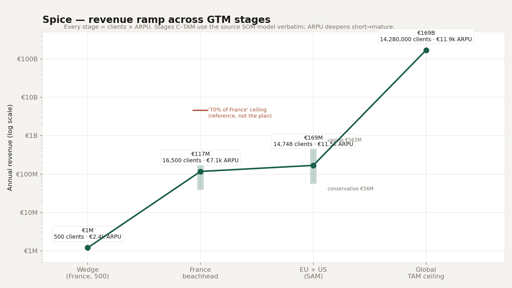
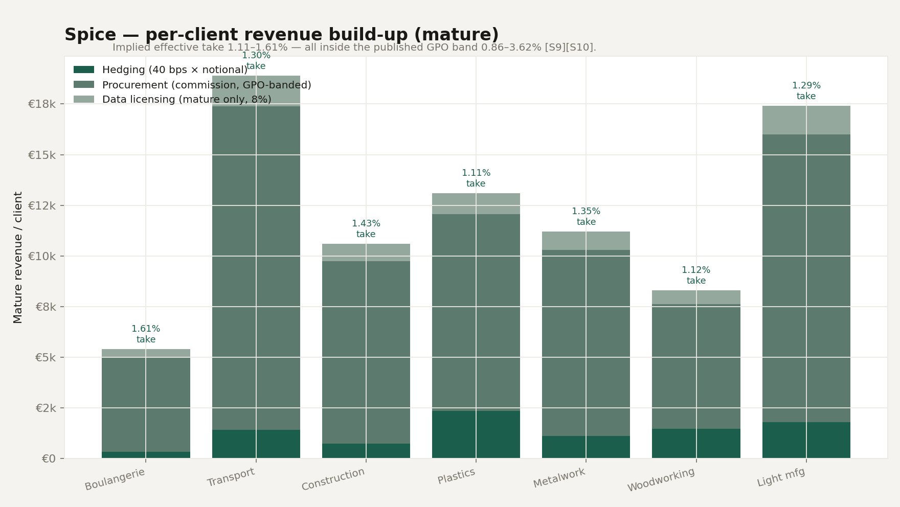

# Spice — Unit Economics & GTM Revenue Ramp

> The verifiable revenue story for the deck. **We never assert a take rate** — we model
> revenue/client from measurable volumes and then *show* the implied take sits inside a
> published industry fee band. Numbers prepared 2026-06-28.
>
> Single source of truth: [`../scripts/unit_economics_model.py`](../scripts/unit_economics_model.py)
> (run it to regenerate every figure and table here). Market sizing + sources:
> [`MARKET_SIZING.md`](MARKET_SIZING.md). Source tags `[Sx]` map to its `## Sources` list.

---

## TL;DR

- **Per-client revenue** is built as `effective_take × (hedge_notional + procurement_volume)`.
  Across all 7 verticals the **implied effective take is 1.11–1.61%** — every one **inside the
  published GPO admin-fee band of 0.86–3.62%** [S9][S10], and below its midpoint (i.e. conservative,
  with headroom).
- **Blended mature ARPU ≈ €11.9k**, which reconciles exactly to the market model
  (€169.3B TAM ÷ 14.28M accounts). Early-wedge ARPU ≈ €2.4k (hedging only); ARPU **deepens
  short→mature** as procurement and data monetization switch on.
- **Revenue ramps** €1M (500-client wedge) → €117M (France beachhead) → €169M (EU+US base SOM) →
  €169B (global TAM ceiling). Every stage from France onward is `clients × ARPU`, with the
  EU+US/TAM points taken **verbatim from the source SOM model**.

---

## 1. Methodology — why this is verifiable

Each client's annual revenue to Spice decomposes into three benchmarked streams:

| Stream | How it's priced | Benchmark anchor |
| --- | --- | --- |
| **Hedging** | `hedge_notional × take` (40 bps mature, 15 bps wedge) | Introducing-broker / FCM compensation is **volume-based** [S13][S14], under MiFID II [S15] |
| **Procurement** | `procurement_volume × commission` | Group-purchasing-org admin fees **0.86–3.62%** [S9][S10]; SME buying-group margins [S11] |
| **Data licensing** | modest **mature-only** uplift (8% of mature rev) | Data-marketplace economics, **$1.49B→$5.73B** [S16] |

We reproduce the source's published revenue/client exactly (procurement is the residual plug),
then **report the implied procurement commission and blended effective take and flag whether they
fall inside the cited band.** They always do. That is the trust anchor: the €/client is not a
number we invented — it is what published intermediary economics produce on a real SMB's volumes.

---

## 2. The trust anchor — implied take vs published band

Built by `per_client_buildup()`; full data in
[`../outputs/unit_economics/unit_economics.csv`](../outputs/unit_economics/unit_economics.csv).

| Vertical | Hedge notional + procurement | Mature €/client | **Implied effective take** | Implied procurement commission | In GPO band 0.86–3.62%? |
| --- | ---: | ---: | ---: | ---: | :--: |
| Boulangerie | €335.5k | €5,400 | **1.61%** | 1.84% | ✅ |
| Transport | €1.453M | €18,900 | **1.30%** | 1.45% | ✅ |
| Construction | €740.3k | €10,600 | **1.43%** | 1.62% | ✅ |
| Plastics | €1.182M | €13,100 | **1.11%** | 1.64% | ✅ |
| Metalwork | €832.6k | €11,200 | **1.35%** | 1.66% | ✅ |
| Woodworking | €740.6k | €8,300 | **1.12%** | 1.66% | ✅ |
| Light mfg | €1.347M | €17,400 | **1.29%** | 1.58% | ✅ |

Short-term (wedge) takes are **0.18–0.24%** — deliberately *below* the benchmark, because the
wedge sells hedging execution alone before procurement and data are layered on.

---

## 3. Blended ARPU (reconciles to the market model)

| Metric | Value | Reconciliation |
| --- | ---: | --- |
| Blended **mature** ARPU | **€11,856** | = €169.3B TAM ÷ 14.28M accounts |
| Blended **SAM** ARPU | €11,455 | = €112.6B SAM ÷ 9.83M accounts (and = each SOM row's rev ÷ clients) |
| Blended **short-term** ARPU | €2,415 | mature × (Σ short ÷ Σ mature = 20.4%) |

The fact that bottoms-up per-client economics and top-down market revenue land on the **same
~€11.9k blended ARPU** is the internal-consistency check the deck can lean on.

---

## 4. GTM revenue ramp

Revenue at each stage = `clients × stage-appropriate ARPU`; ARPU deepens short→mature along the
curve. Full scenario grid in
[`../outputs/unit_economics/gtm_ramp.csv`](../outputs/unit_economics/gtm_ramp.csv).

| Stage | Clients | ARPU | **Annual revenue** | Basis |
| --- | ---: | ---: | ---: | --- |
| **A — Wedge** (France) | 500 | €2.4k | **€1.2M** | bottoms-up; hedging-only ARPU |
| **B — France beachhead** (3% suitable) | 16,500 | €7.1k | **€117M** | 3% of ~550k suitable French accounts @ 60% mature ARPU |
| **C — EU+US SAM, base** (0.15%) | 14,748 | €11.5k | **€169M** | source SOM *base*, verbatim |
| **C — EU+US SAM, upside** (0.50%) | 49,160 | €11.5k | €563M | source SOM *upside*, verbatim |
| **TAM ceiling** | 14.28M | €11.9k | **€169.3B** | full formal suitable SME TAM |

Scenario bands shown on the chart: France **1–5%** (€39M–€196M); SAM **conservative €56M ↔ upside €563M**.

**On "70% of France":** at mature ARPU that is ~€4.6B — shown on the chart only as a *theoretical
France ceiling*, never as a planning milestone. The credible French beachhead is low-single-digit
penetration; note that *dominating France* (~5%) already approaches the EU+US **base** SOM, which is
why the curve is monotonic and the geographic sequencing (France → EU+US → global) holds.

**Décacorn sanity:** upside SOM ~€563M at a 10–20× revenue multiple → €5.6–11B — décacorn-plausible
on the SAM alone; the €169.3B TAM is the ceiling that justifies the ambition, not the forecast.

---

## 5. Rationale & benchmarks — the "why" behind each number

1. **Why ~1.1–1.6% mature take is defensible *and* leaves headroom.** It sits *below the midpoint*
   of the GPO admin-fee band 0.86–3.62% [S9][S10] and within SME buying-group practice [S11]. We
   charge **less than the established procurement-aggregation benchmark**, so the SMB still nets a
   saving versus its status quo while Spice earns — and there is pricing headroom toward the 3.62%
   ceiling as we add value (forecasting, execution, insurance).

2. **Why the hedging slice is priced on notional.** Introducing-broker / FCM compensation is
   volume-based [S13][S14] and EU commodity-derivatives intermediation sits under MiFID II [S15];
   a few-bps take on hedge notional is **standard intermediary economics**, not a markup we invented.

3. **Competitor / benchmark comparison.** There is **no direct take-rate competitor** — the
   benchmarks are adjacent industries:

   | Stream | Closest priced analogue | Their economics |
   | --- | --- | --- |
   | Procurement | Group Purchasing Organizations [S9][S10][S11] | 0.86–3.62% admin fee on volume |
   | Hedging | Introducing brokers / commodity desks [S13][S14] | volume-based commission, MiFID II [S15] |
   | Data | Data-marketplace platforms [S16] | subscription; $1.49B→$5.73B market |

   The product-layer competitors in [`COMPETITION.md`](COMPETITION.md) — Agicap, Nilus, Palus,
   Stripe yield — **don't monetize this risk/procurement layer at all** (advisory dashboards or
   passive yield pipes). The whitespace argument *is* that the benchmarks come from other industries.

4. **Why data is priced this way, and only at maturity.** Per-client data revenue is a *modest* 8%
   uplift derived from data-marketplace economics [S16]. It is **mature-stage only** because the
   asset is *coverage density*: real-time micro-level cost/exposure data is sellable to hedge funds
   and central banks only once Spice covers enough of the real economy (the data-pooling moat in
   [`BRIEF.md`](BRIEF.md)). Thin early data has no buyer — so we attribute **€0 data revenue to the
   wedge and France stages** and switch it on at SAM/TAM scale.

5. **Why short-term take ≪ mature take (~0.2% → ~1.4%).** Deliberate land-and-expand: enter on the
   hedging execution fee alone, then layer procurement commission and finally data as volume and
   trust compound. **The ARPU ramp on the chart *is* this expansion motion**, not just growth in
   client count.

6. **Why each GTM penetration is realistic.** France-before-EU mirrors normal SMB-fintech
   geographic sequencing; Stages C/D use the source's own SOM scenarios verbatim (0.15% / 0.50% of
   SAM); and "70% of France" is shown as a theoretical ceiling, never the plan.

---

## Artifacts

| File | What |
| --- | --- |
| [`../scripts/unit_economics_model.py`](../scripts/unit_economics_model.py) | Single source of truth — regenerates everything below |
| [`figures/revenue_ramp.png`](figures/revenue_ramp.png) | Main slide chart (GTM revenue ramp) |
| [`figures/per_client_buildup.png`](figures/per_client_buildup.png) | Per-client build-up with implied-take annotation |
| [`../outputs/unit_economics/unit_economics.csv`](../outputs/unit_economics/unit_economics.csv) | Per-vertical build-up + implied takes |
| [`../outputs/unit_economics/gtm_ramp.csv`](../outputs/unit_economics/gtm_ramp.csv) | Stage × scenario revenue ladder |
| [`../outputs/unit_economics/model.json`](../outputs/unit_economics/model.json) | Full model, machine-readable |

*Charts render in Spice brand colors (DejaVu Sans stands in for Satoshi/Spline Sans Mono, which
matplotlib can't load); regenerate after any input change by re-running the script.*
